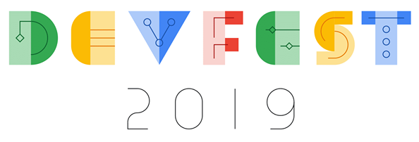

# GDG DevFest 2019 Frontend task solution

     
     
    
     
     
    
Demo for GDG DevFest 2019 Bishkek

     

## `Hi-tech` setup
_______________

### How to setup environment
* Install [VSCode](https://code.visualstudio.com/)
* Set alias for ability to open `VSCode` from command line as `code` (see for [Mac](https://code.visualstudio.com/docs/setup/mac) or for [Windows](https://code.visualstudio.com/docs/setup/windows) or for [Linux](https://code.visualstudio.com/docs/setup/linux))
* Install [Docker Desktop](https://www.docker.com/products/docker-desktop)
* Install [Remote Development](https://marketplace.visualstudio.com/items?itemName=ms-vscode-remote.vscode-remote-extensionpack) extension for VSCode

### How to run demo
* Clone this repo `git clone https://github.com/CyberLight/devfest-gdg-2019.git` to any location
* Go to `devfest-gdg-2019` folder
* Run command `code .` (If you setup alias for VSCode using instructions above)
* Click on `Reopen in Container` button from bottom right corner of `VSCode`
* Wait while `VSCode` installs a remote development environment for `VSCode` in docker
* Go to `chess.scss` and click on `Watch Sass` in the `VSCode` status bar to create raw css of chessboard
  * After that, you will see two new files in the project root folder
* Open remote terminal and run `npm test` for run all tests using headles chrome inside Docker
  * Or run `npm start` and open `http://localhost:9001` in your `Google Chrome` browser

## `Regular` setup
_______________

* Install `node.js latest` to your system
* Install [VSCode](https://code.visualstudio.com/)
* Clone this repo `git clone https://github.com/CyberLight/devfest-gdg-2019.git` to any location
* Launch VSCode and open `devfest-gdg-2019` folder
* Install the following `VSCode` extensions
  * `ESLint`
  * `Live Sass Compiler`
* Go to `chess.scss` and click on `Watch Sass` in the `VSCode` status bar to create raw css of chessboard
  * After that, you will see two new files in the project root folder
* In `VSCode` integrated terminal run `npm test` (for running tests) or `npm start` (for viewing final result of task solution)

## Special thanks to
_______________

